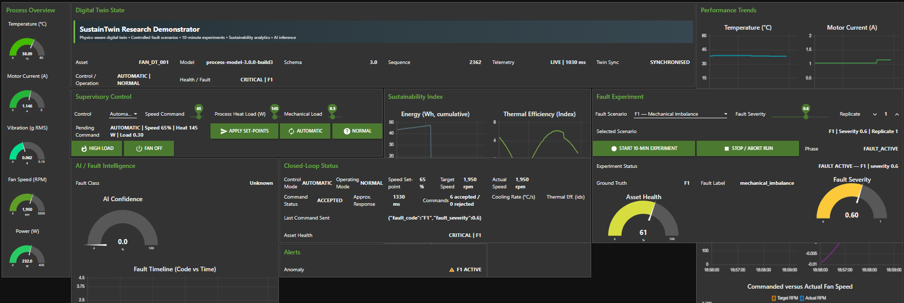

# PhysDiagTwin

<p align="center">
  <strong>A Physics-Aware Digital Twin Framework for Controlled Fault-Data Generation and Industrial Process Diagnosis</strong>
</p>

<p align="center">
  
  
  
  
  
</p>

<p align="center"><em>Controlled fault generation · Traceable experimentation · External behavioural evidence · Leakage-aware diagnosis</em></p>

---

<p align="center">
  
</p>

<p align="center"><em>PhysDiagTwin Node-RED research dashboard showing experiment orchestration, live telemetry, fault state, severity and closed-loop command status.</em></p>

---

## About PhysDiagTwin

**PhysDiagTwin** is a lightweight, physics-aware digital twin research framework developed to investigate controlled fault-data generation and diagnostic evaluation in a fan-driven thermal process.

The framework connects a reduced-order dynamic process model with bidirectional MQTT communication, Node-RED experiment orchestration, structured ground-truth capture and a leakage-aware Python analysis pipeline. Four fault mechanisms are introduced as explicit perturbations of a common healthy process model rather than as independent anomalous data generators.

> **A synthetic fault dataset is more defensible when the path from fault intervention to recorded evidence is explicit, controlled and traceable.**

PhysDiagTwin is a **research demonstrator**. It is not presented as a fully calibrated digital replica of a specific industrial fan or as a deployment-ready industrial protection system.

---

## At a glance

| Item | PhysDiagTwin implementation |
|---|---|
| Process | Fan-driven thermal process |
| Healthy reference | Common reduced-order physics-aware process model |
| Fault classes | `F1` mechanical imbalance, `F2` electrical overcurrent, `F3` cooling degradation, `F4` thermal overload |
| Programmed severities | `0.3`, `0.6`, `0.9` |
| Experimental protocol | 60 s baseline + 480 s fault-active + 60 s recovery |
| Accepted experiments | **14 runs** |
| Recorded observations | **8,141 telemetry samples** |
| Nominal sampling | approximately **1 Hz** |
| Communication | Bidirectional MQTT |
| Orchestration | Node-RED |
| Embedded platform | Arduino UNO R4 WiFi |
| Analysis | Python / scikit-learn |
| Primary validation boundary | Complete experimental runs |
| External evidence | Independent industrial fan historian |
| Best continuous five-class macro-F1 | **0.9017** |
| Best binary healthy--fault macro-F1 | **0.9587** |
| Fault-active four-class macro-F1 | **0.9998** |

---

## Research architecture

<p align="center">
  
</p>

<p align="center"><em>PhysDiagTwin architecture linking the physics-aware process model, experiment orchestration, structured data acquisition, external behavioural evidence and diagnostic evaluation.</em></p>

The framework separates four responsibilities while preserving traceability between them:

1. **Physics-aware process model** — generates the dynamic mechanical, electrical and thermal state.
2. **Bidirectional communication** — exchanges telemetry and experiment commands through MQTT.
3. **Experiment orchestration** — Node-RED controls fault class, severity, timing, replicate and experiment status.
4. **Analytical evaluation** — qualified data are used for physics-response analysis, external behavioural comparison and experiment-level machine-learning evaluation.

---

## Controlled fault model

Every fault is applied to the same healthy process model.

| Code | Condition | Principal model effect |
|---|---|---|
| `F0` | Healthy | Nominal parameterisation |
| `F1` | Mechanical imbalance | Increased vibration and effective mechanical loading |
| `F2` | Electrical overcurrent | Increased current and electrical power with secondary thermal loading |
| `F3` | Cooling degradation | Reduced cooling efficiency and increased thermal resistance |
| `F4` | Thermal overload | Increased effective process heat input |

Programmed severity levels:

- **0.3** — low
- **0.6** — medium
- **0.9** — high

These values are model-specific perturbation levels, not universal industrial damage percentages.

---

## Experimental protocol

Each controlled experiment follows the same 10-minute sequence:

```text
0 s                    60 s                                 540 s             600 s
│----------------------│------------------------------------│------------------│
      HEALTHY BASELINE                FAULT ACTIVE                  RECOVERY
           F0                       selected F1–F4                      F0
