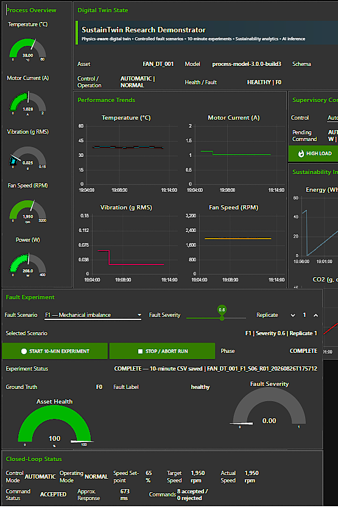
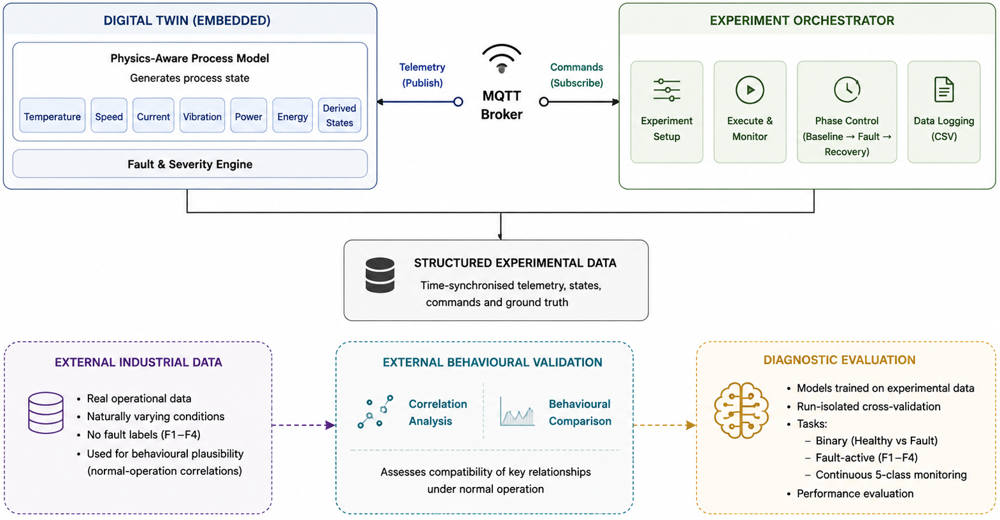
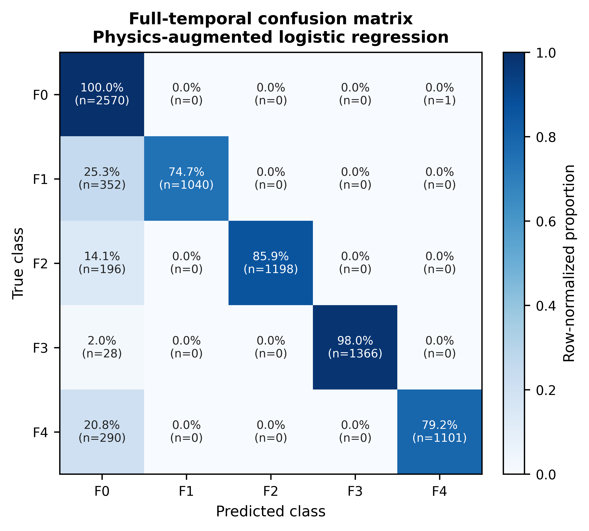
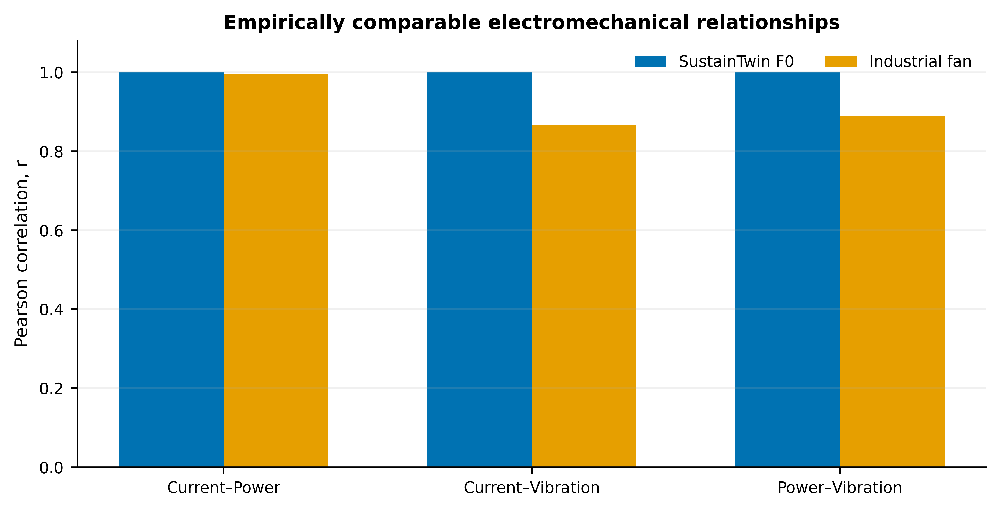

# SustainTwin

<p align="center">
  <strong>A Physics-Aware Digital Twin Framework for Controlled Fault-Data Generation and Diagnostic Evaluation</strong>
</p>

<p align="center">
  
  
  
  
  
</p>

<p align="center"><em>Controlled fault generation · Traceable experimentation · External behavioural evidence · Leakage-aware diagnosis</em></p>

---

<p align="center">
  
</p>

<p align="center"><em>SustainTwin Node-RED research dashboard showing experiment orchestration, live telemetry, fault state, severity and closed-loop command status.</em></p>

---

## About SustainTwin

**SustainTwin** is a lightweight, physics-aware digital twin research framework developed to investigate controlled fault-data generation and diagnostic evaluation in a fan-driven thermal process.

The framework connects a reduced-order dynamic process model with bidirectional MQTT communication, Node-RED experiment orchestration, structured ground-truth capture and a leakage-aware Python analysis pipeline. Four fault mechanisms are introduced as explicit perturbations of a common healthy process model rather than as independent anomalous data generators.

> **A synthetic fault dataset is more defensible when the path from fault intervention to recorded evidence is explicit, controlled and traceable.**

SustainTwin is a **research demonstrator**. It is not presented as a fully calibrated digital replica of a specific industrial fan or as a deployment-ready industrial protection system.

---

## At a glance

| Item | SustainTwin implementation |
|---|---|
| Process | Fan-driven thermal process |
| Healthy reference | Common reduced-order physics-aware process model |
| Fault classes | `F1` mechanical imbalance, `F2` electrical overcurrent, `F3` cooling degradation, `F4` thermal overload |
| Programmed severities | `0.3`, `0.6`, `0.9` |
| Experimental protocol | 60 s baseline + 480 s fault-active + 60 s recovery |
| Accepted experiments | **14 runs** |
| Recorded observations | **8,141 telemetry samples** |
| Nominal sampling | approximately **1 Hz** |
| Communication | Bidirectional MQTT |
| Orchestration | Node-RED |
| Embedded platform | Arduino UNO R4 WiFi |
| Analysis | Python / scikit-learn |
| Primary validation boundary | Complete experimental runs |
| External evidence | Independent industrial fan historian |
| Best continuous five-class macro-F1 | **0.9017** |
| Best binary healthy--fault macro-F1 | **0.9587** |
| Fault-active four-class macro-F1 | **0.9998** |

---

## Research architecture

<p align="center">
  
</p>

<p align="center"><em>SustainTwin architecture linking the physics-aware process model, experiment orchestration, structured data acquisition, external behavioural evidence and diagnostic evaluation.</em></p>

The framework separates four responsibilities while preserving traceability between them:

1. **Physics-aware process model** — generates the dynamic mechanical, electrical and thermal state.
2. **Bidirectional communication** — exchanges telemetry and experiment commands through MQTT.
3. **Experiment orchestration** — Node-RED controls fault class, severity, timing, replicate and run status.
4. **Analytical evaluation** — qualified data are used for physics-response analysis, external behavioural comparison and run-isolated machine-learning evaluation.

---

## Controlled fault model

Every fault is applied to the same healthy process model.

| Code | Condition | Principal model effect |
|---|---|---|
| `F0` | Healthy | Nominal parameterisation |
| `F1` | Mechanical imbalance | Increased vibration and effective mechanical loading |
| `F2` | Electrical overcurrent | Increased current and electrical power with secondary thermal loading |
| `F3` | Cooling degradation | Reduced cooling efficiency and increased thermal resistance |
| `F4` | Thermal overload | Increased effective process heat input |

Programmed severity levels:

- **0.3** — low
- **0.6** — medium
- **0.9** — high

These values are model-specific perturbation levels, not universal industrial damage percentages.

---

## Experimental protocol

Each controlled run follows the same 10-minute sequence:

```text
0 s                    60 s                                 540 s             600 s
│----------------------│------------------------------------│------------------│
      HEALTHY BASELINE                FAULT ACTIVE                  RECOVERY
           F0                       selected F1–F4                      F0
```

For healthy-reference experiments, `F0` remains active throughout the complete 600 s timing structure.

Each run retains experiment identifiers, timestamps, phase, commanded fault and severity, returned embedded fault state, process measurements, physics-derived states and traceability metadata.

---

## Diagnostic evaluation

Three diagnostic questions are evaluated:

1. **Continuous five-class monitoring** — `F0–F4` across baseline, fault-active and recovery periods.
2. **Healthy--fault detection** — binary discrimination between healthy and active-fault states.
3. **Fault-active four-class classification** — discrimination among `F1–F4` during the active-fault interval.

**Process-observable representation**

`Temperature · Fan speed · Current · Vibration · Power · Cooling rate`

**Physics-augmented representation**

`Process-observable features + Cooling efficiency + Thermal resistance`

Cooling efficiency and thermal resistance are internal twin states, not independent physical sensors.

---

## Headline results

| Evaluation | Best representation / model | Accuracy | Macro-F1 |
|---|---|---:|---:|
| Continuous `F0–F4` monitoring | Physics-augmented Logistic Regression | 0.8935 | **0.9017** |
| Healthy--fault detection | Process-observable Logistic Regression | 0.9633 | **0.9587** |
| Fault-active `F1–F4` classification | Physics-augmented Logistic Regression | 0.9998 | **0.9998** |
| Low-severity fault-active classification | Physics-augmented Logistic Regression | 1.0000 | **1.0000** |

Physics augmentation increased continuous five-class Logistic Regression macro-F1 from **0.8432 to 0.9017**.

### Continuous five-class confusion matrix

<p align="center">
  
</p>

<p align="center"><em>Pooled out-of-fold confusion matrix for the highest-performing continuous five-class model under run-grouped evaluation.</em></p>

The fault-active score reflects strong separation among the programmed SustainTwin fault states once their effects are established. It should not be interpreted as near-perfect industrial diagnosis.

---

## External industrial behavioural evidence

<p align="center">
  
</p>

<p align="center"><em>Comparison of electromechanical relationships empirically estimable in both SustainTwin and the independent industrial historian.</em></p>

| Relationship | SustainTwin | Industrial historian |
|---|---:|---:|
| Current--Power | 1.000 | 0.996 |
| Current--Vibration | 1.000 | 0.866 |
| Power--Vibration | 1.000 | 0.887 |

The industrial historian contains no independently verified labels corresponding to `F1–F4`. It is therefore used to assess compatible normal-operation behaviour, not industrial fault-class accuracy.

---

## Validation boundary

### Supported by the current evidence

- controlled and reproducible fault interventions;
- continuous baseline--fault--recovery trajectories;
- severity-dependent mechanical, electrical and thermal responses;
- traceable commanded and returned embedded fault states;
- bounded external electromechanical plausibility;
- run-isolated diagnostic performance within SustainTwin; and
- quantification of the additional information provided by internal twin states.

### Not established by the current evidence

- calibrated reproduction of a specific industrial fan;
- industrial ground-truth validation of `F1–F4`;
- population-level generalisation across machines;
- universal physical calibration of the programmed severity scale; or
- deployment-ready diagnostic performance on an unseen industrial asset.

---

## Why the evaluation design matters

A single 600 s run produces hundreds of related telemetry rows. These are not hundreds of independent experiments.

SustainTwin therefore uses the complete experimental run as the machine-learning partition boundary:

```text
Run A ─┐
Run B ─┼── TRAIN
Run C ─┘

Run D ───── TEST
```

This reduces sample-level leakage and provides a more defensible estimate of cross-run performance than random row-wise splitting.

---

## Repository layout

```text
SustainTwin/
│
├── README.md
├── CITATION.cff
├── LICENSE
├── requirements.txt
│
├── firmware/
│   └── Arduino_UNO_R4_WiFi/
│
├── node-red/
│   ├── flows/
│   └── dashboard/
│
├── data/
│   ├── experiment_results/
│   └── qualified/
│
├── analysis/
│   ├── preprocessing/
│   ├── physics_validation/
│   ├── external_validation/
│   ├── machine_learning/
│   └── figure_generation/
│
├── Manuscript_Figures/
│   ├── SustainTwin_NodeRED_Dashboard.png
│   ├── architecture.png
│   ├── Fig_03_external_behavioural_validation.png
│   └── Fig_06_full_temporal_confusion_matrix.png
│
└── docs/
    └── supplementary_material/
```

---

## Reproducing the evidence chain

```text
Physics-aware process model
            ↓
Node-RED orchestration
            ↓
Controlled fault intervention
            ↓
Run-specific telemetry
            ↓
Data-quality qualification
            ↓
Frozen evidence dataset
            ↓
Physics and severity analysis
       ↙                ↘
Industrial               Run-grouped
behavioural evidence     AI evaluation
       ↘                ↙
      Manuscript evidence pack
```

For manuscript reproducibility, use the frozen qualified dataset associated with the archival release.

---

## Data and code availability

The intended public research release contains the embedded process-model implementation, Node-RED orchestration flow, experimental telemetry supporting the manuscript, preprocessing and analysis scripts, grouped machine-learning evaluation, figure-generation code and reproducibility documentation.

The independent industrial historian should only be redistributed where its data-sharing conditions permit.

---

## Manuscript

**SustainTwin: A Physics-Aware Digital Twin Framework for Controlled Fault-Data Generation and Diagnostic Evaluation**

Original research manuscript prepared for the *Philosophical Transactions of the Royal Society A* Theme Issue:

**Advanced Materials and Digital Technologies for Sustainable Energy and Industrial Systems**

---

## Citation

If you use SustainTwin, its methodology, code or archived dataset, please cite the associated manuscript and research artifact.

A machine-readable citation template is included in [`CITATION.cff`](CITATION.cff).

**Zenodo DOI:** pending archival release

Recommended manuscript release tag:

```text
v1.0.0-manuscript
```

---

## Responsible use

SustainTwin is intended for digital-twin research, controlled fault-data experimentation, condition-monitoring research, machine-learning evaluation, teaching and prototyping.

It is not a certified safety system, industrial protection system or substitute for established machine-protection and maintenance procedures.

---

## Authors

**Adewale Ogabi** · **M. Shahwaiz Afaqui** · **Geetika Aggarwal** · **Michael Short**

School of Computing, Engineering and Digital Technologies  
Teesside University, United Kingdom

**Correspondence:** Adewale Ogabi — `hello@adewaleogabi.info`

---

## Acknowledgement

The authors gratefully acknowledge the research environment and support provided by the research team at Teesside University.

---

<p align="center">
  <strong>SustainTwin</strong><br>
  <sub>Physics-aware digital twins · Controlled fault generation · Traceable experimentation · Intelligent diagnosis</sub>
</p>
